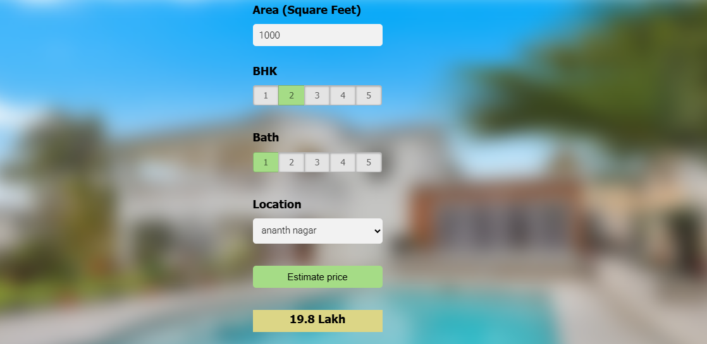

**🏠 House Price Prediction – Full Stack Web Application**

A full stack machine learning web application that predicts house prices based on user-provided features such as location, area, number of bedrooms, and bathrooms.
The project integrates Machine Learning, Backend API, and Frontend UI into a complete end-to-end system.

**🚀 Features**

🔢 Predicts house prices using a trained ML model\n
🌐 User-friendly web interface\n
⚙️ Backend API for model inference\n
📊 Real-time predictions\n
🧠 Trained regression-based ML model

**🛠️ Tech Stack**
Frontend:  HTML  CSS  JavaScript\n
Backend:  Python  Flask (or FastAPI)  REST API\n
Machine Learning:  Python  NumPy  Pandas  Scikit-learn  Matplotlib / Seaborn (for analysis)\n
Tools:  Git & GitHub  VS Code\n

**⚙️ How It Works**

User enters house details on the frontend\n
Data is sent to the backend via API\n
Backend loads the trained ML model\n
Model predicts the house price\n
Prediction is returned and displayed on the UI\n

**Author**
Gaurav
GitHub: KnownGaurav
